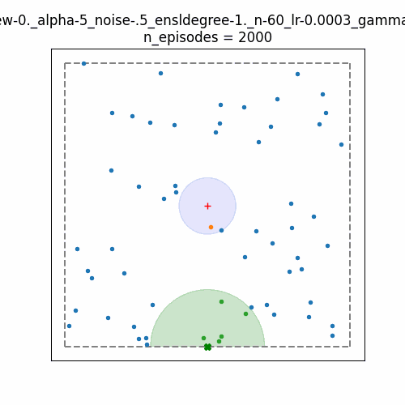
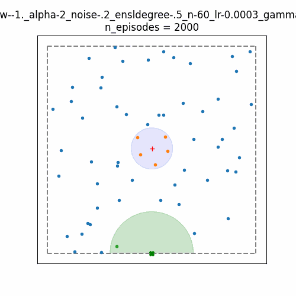
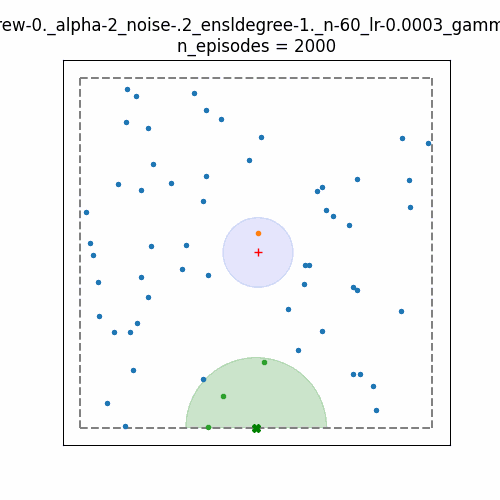
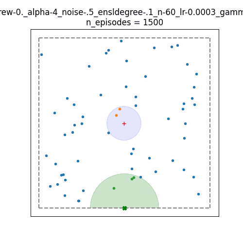
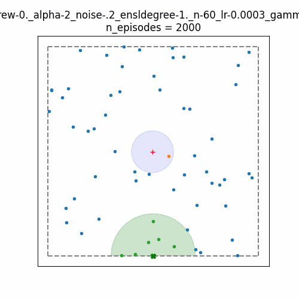
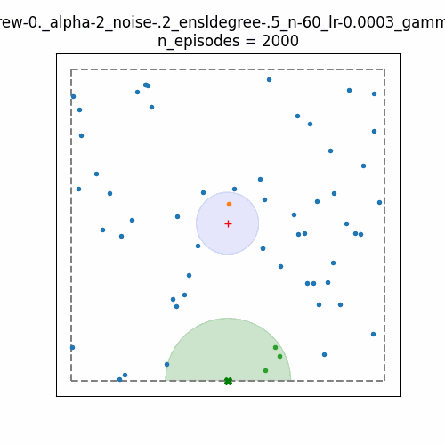
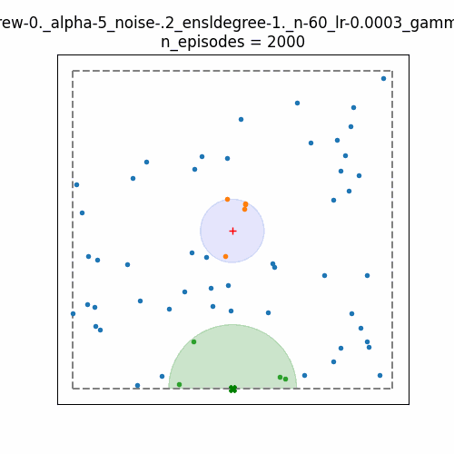
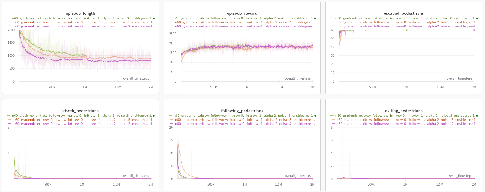

# evacuation

RL environment to study the evacuation of pedestrians for dummly rooms.

## Learning curves for [stable-baselines3](https://github.com/DLR-RM/stable-baselines3/tree/master) PPO agent

[wandb report: smoothed learning curves](https://wandb.ai/albinakl/evacuation/reports/Smoothed-runs-for-paper--Vmlldzo2MTY2MDU0?accessToken=kg5mc3vg9iaukjbgm5t2giijxk95uklzupdkjhiltspgz9epg5ly7s0280lc0def)


[wandb report: comparing rewards study](https://wandb.ai/albinakl/evacuation/reports/Comparing-rewards--Vmlldzo1OTgxMTMw?accessToken=5wgmelubk2p1ws14i22zewpifo00n4dmer1i0uq4db4lhb4231qujrklwzu7bcsp)

## Examples of trajectories

| Comments | Strict leader <br> (enslaving degree = 1.0) | Calm leader <br>  (enslaving degree < 1.0) |
| --- | --- | --- |
| exitrew & followrew |   <br> After saving a big group of pedestrians, leader helped 2 groups of lost pedestrians to find the way to exit |  <br> Leader tends to work with big groups of pedestrians and navigates them to exit zone |
| only exitrew |  <br> At the beginning of the episode leader helps pedestrians near exit and it the end finds the lost ones left far from exit |  <br> Here we can see how pedestrians navigate themselves based on the directions of their neighbours. Leader is trying to collect big group to navigate it to exit. |
| only exitrew |  <br> Due to need to escort pedestrians to exit zone, leader tries to collect as much pedestrians as he can on his first reach of exit.|  <br> Sometimes pedestrians can suddenly panic and try to move in bad direction. Leader mey try to return them or catch all close ones.|
|only followers reward| <br> Even when leader is not given the reward for pedestrians reaching exit zone, he tries to escort them to exit asap.||


## Installation

```bash
git clone https://github.com/cinemere/evacuation
cd evacuation
python -m venv venv
source venv/bin/activate
pip install -r requirements.txt
```

## Quick start

### Setup environment variables

**Before running experints** don't forget to:

```bash
export PYTHONPATH=$PWD
```

### Wandb cheat sheet

**To enable [wandb](https://wandb.ai/site) logging** you need to create your wandb profile and run the following once:
```bash
wandb init
```

* **To disable wandb logging** (for debugging or other reason) you need to run:
  ```bash
  wandb disabled
  ```
* **To enable wandb logging** (when you need to turn on looging again) you need to run:
  ```bash
  wandb enabled
  ```

### Run experiments! 🏃

To run experiment from command line:
```bash
python main.py --exp-name "my-first-experiment"
```

To use evacuation env in your code:

```python
from src.env import EvacuationEnv
from src.agents import RandomAgent

# Initialize environment
env = EvacuationEnv()

# Initialize random agent
random_agent = RandomAgent(env.action_space)

# Initialize episode
obs, _ = env.reset()
terminated, truncated = False, False

# Episode loop
while not (terminated or truncated):
    action = random_agent.act(obs)
    obs, reward, terminated, truncated, _ = env.step(action)

env.save_animation()      # save episode trajectory in giff
env.render()              # save episode trajectory in png

```


## Documentation

**Note.** Currently only stable baselines PPO model is available.

### Input parameters

Most valuable parametes can be set throw argparse module. However some parameters are still in files, here such parameters are outlined:

- [`src/params.py`](src/params.py) $\rightarrow$ parameters of the model (+ logging params)
  - `WALK_DIAGRAM_LOGGING_FREQUENCY` $\rightarrow$ frequency of saving giff of episode trajectories 
- [`src/env/constants.py`](src/env/constants.py) $\rightarrow$ default parameters of the environment
  - `SWITCH_DISTANCE_TO_LEADER` $\rightarrow$ radius of catch by leader
  - `SWITCH_DISTANCE_TO_OTHER_PEDESTRIAN` $\rightarrow$ radius of interactions between pedestrians
  - `SWITCH_DISTANCE_TO_EXIT` $\rightarrow$ raduis of the exit zone
  - `SWITCH_DISTANCE_TO_ESCAPE` $\rightarrow$ raduis of the escape point

- arguments passed to `EvacuationEnv` ([`src/utils.py`](src/utils.py))

```
usage: main.py [-h] [--origin {ppo,a2c}] [--learn-timesteps LEARN_TIMESTEPS] [--learning-rate LEARNING_RATE] [--gamma GAMMA] [--device {cpu,cuda}] [--exp-name EXP_NAME]
               [-v] [--draw] [-n NUMBER_OF_PEDESTRIANS] [--width WIDTH] [--height HEIGHT] [--step-size STEP_SIZE] [--noise-coef NOISE_COEF]
               [--enslaving-degree ENSLAVING_DEGREE] [--is-new-exiting-reward IS_NEW_EXITING_REWARD] [--is-new-followers-reward IS_NEW_FOLLOWERS_REWARD]
               [--intrinsic-reward-coef INTRINSIC_REWARD_COEF] [--is-termination-agent-wall-collision IS_TERMINATION_AGENT_WALL_COLLISION]
               [--init-reward-each-step INIT_REWARD_EACH_STEP] [--max-timesteps MAX_TIMESTEPS] [--n-episodes N_EPISODES] [--n-timesteps N_TIMESTEPS]
               [-e ENABLED_GRAVITY_EMBEDDING] [--alpha ALPHA]

options:
  -h, --help            show this help message and exit

model:
  --origin {ppo,a2c}    which model to use (default: ppo)
  --learn-timesteps LEARN_TIMESTEPS
                        number of timesteps to learn the model (default: 5000000)
  --learning-rate LEARNING_RATE
                        learning rate for stable baselines ppo model (default: 0.0003)
  --gamma GAMMA         gammma for stable baselines ppo model (default: 0.99)
  --device {cpu,cuda}   device for the model (default: cpu)

experiment:
  --exp-name EXP_NAME   prefix of the experiment name for logging results (default: test)
  -v, --verbose         debug mode of logging (default: False)
  --draw                save animation at each step (default: False)

env:
  -n NUMBER_OF_PEDESTRIANS, --number-of-pedestrians NUMBER_OF_PEDESTRIANS
                        number of pedestrians in the simulation (default: 10)
  --width WIDTH         geometry of environment space: width (default: 1.0)
  --height HEIGHT       geometry of environment space: height (default: 1.0)
  --step-size STEP_SIZE
                        length of pedestrian's and agent's step (default: 0.01)
  --noise-coef NOISE_COEF
                        noise coefficient of randomization in viscek model (default: 0.2)

leader params:
  --enslaving-degree ENSLAVING_DEGREE
                        enslaving degree of leader in generalized viscek model (default: 0.1)

reward params:
  --is-new-exiting-reward IS_NEW_EXITING_REWARD
                        if True, positive reward will be given for each pedestrian, entering the exiting zone (default: True)
  --is-new-followers-reward IS_NEW_FOLLOWERS_REWARD
                        if True, positive reward will be given for each pedestrian, entering the leader's zone of influence (default: True)
  --intrinsic-reward-coef INTRINSIC_REWARD_COEF
                        coefficient in front of intrinsic reward (default: 1.0)
  --is-termination-agent-wall-collision IS_TERMINATION_AGENT_WALL_COLLISION
                        if True, agent's wall collision will terminate episode (default: False)
  --init-reward-each-step INIT_REWARD_EACH_STEP
                        constant reward given on each step of agent (default: 0.0)

time:
  --max-timesteps MAX_TIMESTEPS
                        max timesteps before truncation (default: 2000)
  --n-episodes N_EPISODES
                        number of episodes already done (for pretrained models) (default: 0)
  --n-timesteps N_TIMESTEPS
                        number of timesteps already done (for pretrained models) (default: 0)

gravity embedding params:
  -e ENABLED_GRAVITY_EMBEDDING, --enabled-gravity-embedding ENABLED_GRAVITY_EMBEDDING
                        if True use gravity embedding (default: True)
  --alpha ALPHA         alpha parameter of gravity gradient embedding (default: 3)
```

### Outputs

Outputs are to be saved in following directories:

- `saved_data/giff/` $\rightarrow$ episode trajectoriy in giff
- `saved_data/png/` $\rightarrow$ episode trajectory in png
- `saved_data/models/` $\rightarrow$ trained models
- `saved_data/logs/` $\rightarrow$ `${exp_name}.txt` log of episode trajectories
- `saved_data/tb-logs/` $\rightarrow$ `tensorboard` logs
- `wandb/` $\rightarrow$ `wandb` logs

  **Example of logging of conducted experiment**


