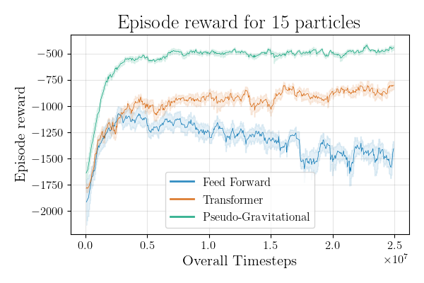
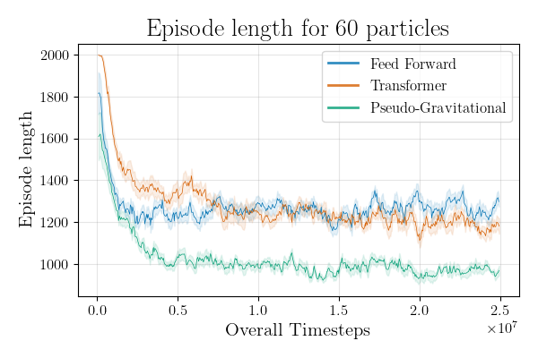
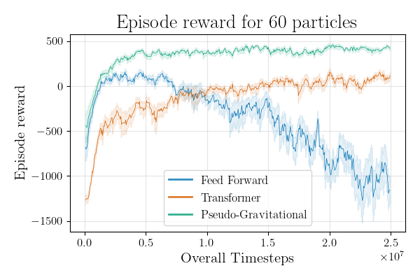
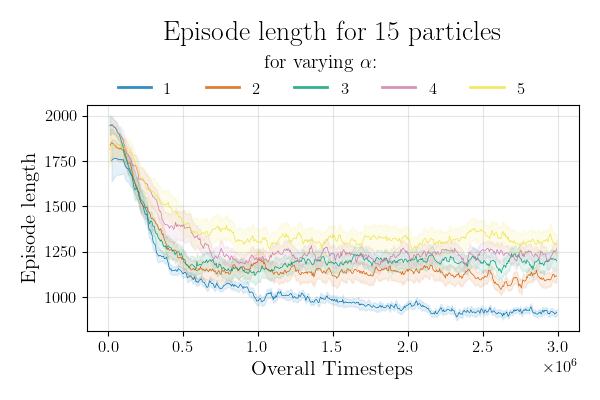
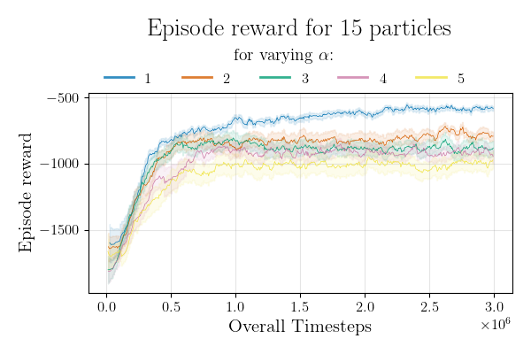
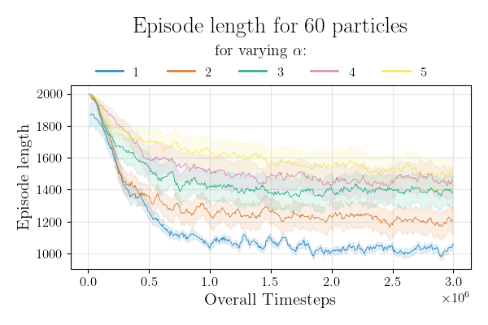
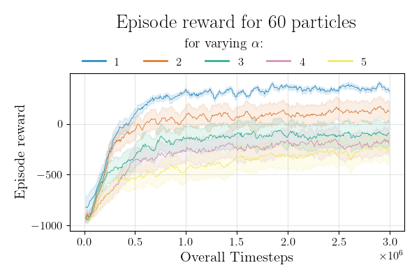

# 🚨 Evacuation: Reinforcement Learning for Crowd Evacuation

[](https://arxiv.org/abs/2509.19972)
[](LICENSE) <!-- optional -->

A reinforcement learning (RL) environment to study the evacuation of pedestrians in dimly lit or low-visibility rooms. This repository contains the official implementation of the method described in:

> **An effective control of large systems of active particles: An application to evacuation problem**  
> [arXiv:2509.19972](https://arxiv.org/abs/2509.19972) | [PDF](https://arxiv.org/pdf/2509.19972)

## Examples of trajectories

| Comments | Strict leader <br> (enslaving degree = 1.0) | Calm leader <br>  (enslaving degree < 1.0) |
| --- | --- | --- |
| exitrew & followrew |   <br> After saving a big group of pedestrians, leader helped 2 groups of lost pedestrians to find the way to exit |   <br> Leader tends to work with big groups of pedestrians and navigates them to exit zone |
| only exitrew |   <br> At the beginning of the episode leader helps pedestrians near exit and it the end finds the lost ones left far from exit |   <br> Here we can see how pedestrians navigate themselves based on the directions of their neighbours. Leader is trying to collect big group to navigate it to exit. |
| only exitrew |   <br> Due to need to escort pedestrians to exit zone, leader tries to collect as much pedestrians as he can on his first reach of exit.|   <br> Sometimes pedestrians can suddenly panic and try to move in bad direction. Leader mey try to return them or catch all close ones.|
|only followers reward|   <br> Even when leader is not given the reward for pedestrians reaching exit zone, he tries to escort them to exit asap.||


## Installation

```bash
git clone https://github.com/cinemere/evacuation
cd evacuation
python -m venv venv
source venv/bin/activate
pip install -r requirements.txt
```

## Quick start

### Setup environment variables

Here are the default values, which can be changed via environmental variables:
```bash
TBLOGS_DIR ?= "./saved_data/tb_logs"
WANDB_DIR ?= "./saved_data/"
CONFIG ?= "<path-to-yaml-conifg>"  # to setup arguments from config 
DEVICE ?= "cpu"
```

### Wandb cheat sheet

**To enable [wandb](https://wandb.ai/site) logging** you need to create your wandb profile and run the following once:
```bash
wandb init
```

* **To disable wandb logging** (for debugging or other reason) you need to run:
  ```bash
  wandb disabled
  ```
* **To enable wandb logging** (when you need to turn on looging again) you need to run:
  ```bash
  wandb enabled
  ```

### Run experiments! 🏃

To run experiment from command line:
```bash
python src/main.py --env.experiment-name "my-first-experiment"
```

To use evacuation env in your code:

```python
from src.env import setup_env, EnvConfig, EnvWrappersConfig
from src.agents import RandomAgent

# Initialize environment
env = setup_env(EnvConfig, EnvWrappersConfig)

# Initialize random agent
random_agent = RandomAgent(env.action_space)

# Initialize episode
obs, _ = env.reset()
terminated, truncated = False, False

# Episode loop
while not (terminated or truncated):
    action = random_agent.act(obs)
    obs, reward, terminated, truncated, _ = env.step(action)

env.save_animation()      # save episode trajectory in giff
env.render()              # save episode trajectory in png

```

To run learning of an RPO agent with transformer embedding use:

```
python3 src/main.py --env.experiment-name "my-experiment" \
                    --wrap.positions rel \
                    --wrap.statuses ohe \
                    --wrap.type Box \
                    model:clean-rl-config \
                    model.network:rpo-transformer-embedding-config
```

To run learning of an RPO agent with gravity encoding of observations use:

```
python3 src/main.py --env.experiment-name "my-experiment" \
                    --wrap.positions grav \
                    model:clean-rl-config \
                    model.network:rpo-transformer-embedding-config \
                    model.network:rpo-linear-network-config
```


## Documentation

### Input parameters

Most valuable parametes can be set throw command line. However some parameters are in files, here such parameters are outlined:

- [`src/env/constants.py`](src/env/constants.py) $\rightarrow$ switch distances:
  - `SWITCH_DISTANCE_TO_LEADER` $\rightarrow$ radius of catch by leader
  - `SWITCH_DISTANCE_TO_OTHER_PEDESTRIAN` $\rightarrow$ radius of interactions between pedestrians
  - `SWITCH_DISTANCE_TO_EXIT` $\rightarrow$ raduis of the exit zone
  - `SWITCH_DISTANCE_TO_ESCAPE` $\rightarrow$ raduis of the escape point

- arguments passed to `EvacuationEnv` ([`src/utils.py`](src/utils.py))

```bash
usage: main.py [-h] [OPTIONS] [{model:sb-config,model:clean-rl-config,model:type}]

        To use yaml config set the env variable `CONFIG`:

        `CONFIG=<path-to-yaml-config> python main.py`

╭─ options ─────────────────────────────────────────────────────────────────────────────╮
│ -h, --help              show this help message and exit                               │
╰───────────────────────────────────────────────────────────────────────────────────────╯
╭─ env options ─────────────────────────────────────────────────────────────────────────╮
│ env params                                                                            │
│ ───────────────────────────────────────────────────────────────────────────────────── │
│ --env.experiment-name STR                                                             │
│                         prefix of the experiment name for logging results (default:   │
│                         test)                                                         │
│ --env.number-of-pedestrians INT                                                       │
│                         number of pedestrians in the simulation (default: 10)         │
│ --env.width FLOAT       geometry of environment space: width (default: 1.0)           │
│ --env.height FLOAT      geometry of environment space: height (default: 1.0)          │
│ --env.step-size FLOAT   length of pedestrian\'s and agent\'s step Typical expected    │
│                         values: 0.1, 0.05, 0.01 (default: 0.01)                       │
│ --env.noise-coef FLOAT  noise coefficient of randomization in viscek model (default:  │
│                         0.2)                                                          │
│ --env.eps FLOAT         eps (default: 1e-08)                                          │
│ --env.enslaving-degree FLOAT                                                          │
│                         enslaving degree of leader in generalized viscek model vary   │
│                         in (0; 1], where 1 is full enslaving. Typical expected        │
│                         values: 0.1, 0.5, 1. (default: 1.0)                           │
│ --env.is-new-exiting-reward, --env.no-is-new-exiting-reward                           │
│                         if True, positive reward will be given for each pedestrian,   │
│                         entering the exiting zone (default: False)                    │
│ --env.is-new-followers-reward, --env.no-is-new-followers-reward                       │
│                         if True, positive reward will be given for each pedestrian,   │
│                         entering the leader\'s zone of influence (default: True)      │
│ --env.intrinsic-reward-coef FLOAT                                                     │
│                         coefficient in front of intrinsic reward (default: 0.0)       │
│ --env.is-termination-agent-wall-collision,                                            │
│ --env.no-is-termination-agent-wall-collision                                          │
│                         if True, agent\'s wall collision will terminate episode       │
│                         (default: False)                                              │
│ --env.init-reward-each-step FLOAT                                                     │
│                         constant reward given on each step of agent. Typical expected │
│                         values: 0, -1. (default: -1.0)                                │
│ --env.max-timesteps INT                                                               │
│                         max timesteps before truncation (default: 2000)               │
│ --env.n-episodes INT    number of episodes already done (for pretrained models)       │
│                         (default: 0)                                                  │
│ --env.n-timesteps INT   number of timesteps already done (for pretrained models)      │
│                         (default: 0)                                                  │
│ --env.render-mode {None}|STR                                                          │
│                         render mode (has no effect) (default: None)                   │
│ --env.draw, --env.no-draw                                                             │
│                         enable saving of animation at each step (default: False)      │
│ --env.verbose, --env.no-verbose                                                       │
│                         enable debug mode of logging (default: False)                 │
│ --env.giff-freq INT     frequency of logging the giff diagram (default: 500)          │
│ --env.wandb-enabled, --env.no-wandb-enabled                                           │
│                         enable wandb logging (if True wandb.init() should be called   │
│                         before initializing the environment) (default: True)          │
│ --env.path-giff STR     path to save giff animations: {path_giff}/{experiment_name}   │
│                         (default: saved_data/giff)                                    │
│ --env.path-png STR      path to save png images of episode trajectories:              │
│                         {path_png}/{experiment_name} (default: saved_data/png)        │
│ --env.path-logs STR     path to save logs: {path_logs}/{experiment_name} (default:    │
│                         saved_data/logs)                                              │
╰───────────────────────────────────────────────────────────────────────────────────────╯
╭─ wrap options ────────────────────────────────────────────────────────────────────────╮
│ env wrappers params                                                                   │
│ ───────────────────────────────────────────────────────────────────────────────────── │
│ --wrap.num-obs-stacks INT                                                             │
│                         number of times to stack observation (default: 1)             │
│ --wrap.positions {abs,rel,grav}                                                       │
│                         positions:                                                    │
│                         - 'abs': absolute coordinates                                 │
│                         - 'rel': relative coordinates                                 │
│                         - 'grav': gradient gravity potential encoding                 │
│                         (GravityEncoding) (default: abs)                              │
│ --wrap.statuses {no,ohe,cat}                                                          │
│                         add pedestrians statuses to obeservation as one-hot-encoded   │
│                         columns. NOTE: this value has no effect when                  │
│                         `positions`='grad' is selected. (default: no)                 │
│ --wrap.type {Dict,Box}  concatenate Dict-type observation to a Box-type observation   │
│                         (with added statuses to the observation) (default: Dict)      │
│ --wrap.alpha FLOAT      alpha parameter of GravityEncoding. The value of alpha        │
│                         determines the strength and shape of the potential function.  │
│                         Higher value results in a stronger repulsion between the      │
│                         agent and the pedestrians, a lower value results in a weaker  │
│                         repulsion. Typical expected values vary from 1 to 5.          │
│                         (default: 3)                                                  │
╰───────────────────────────────────────────────────────────────────────────────────────╯
## MODEL PARAMETERS:
╭─ optional subcommands ────────────────────────────────────────────────────────────────╮
│ select the config of model  (default: model:type)                                     │
│ ───────────────────────────────────────────────────────────────────────────────────── │
│ [{model:sb-config,model:clean-rl-config,model:type}]                                  │
│     model:sb-config     Stable Baselines Model Config                                 │
│     model:clean-rl-config                                                             │
│                         Clean RL Model Config                                         │
│     model:type                                                                        │
╰───────────────────────────────────────────────────────────────────────────────────────╯
╭─ model.agent options ─────────────────────────────────────────────────────────────────╮
│ select the parametrs of trainig the agent                                             │
│ ───────────────────────────────────────────────────────────────────────────────────── │
│ --model.agent.exp-name STR                                                            │
│     the name of this experiment (default: rpo-agent)                                  │
│ --model.agent.seed INT                                                                │
│     seed of the experiment (default: 1)                                               │
│ --model.agent.torch-deterministic, --model.agent.no-torch-deterministic               │
│     if toggled, `torch.backends.cudnn.deterministic=False` (default: True)            │
│ --model.agent.cuda, --model.agent.no-cuda                                             │
│     if toggled, cuda will be enabled by default (default: True)                       │
│ --model.agent.total-timesteps INT                                                     │
│     total timesteps of the experiments (default: 80000000)                            │
│ --model.agent.learning-rate FLOAT                                                     │
│     the learning rate of the optimizer (default: 0.0003)                              │
│ --model.agent.num-envs INT                                                            │
│     the number of parallel game environments (default: 3)                             │
│ --model.agent.num-steps INT                                                           │
│     the number of steps to run in each environment per policy rollout (default: 2048) │
│ --model.agent.anneal-lr, --model.agent.no-anneal-lr                                   │
│     Toggle learning rate annealing for policy and value networks (default: True)      │
│ --model.agent.gamma FLOAT                                                             │
│     the discount factor gamma (default: 0.99)                                         │
│ --model.agent.gae-lambda FLOAT                                                        │
│     the lambda for the general advantage estimation (default: 0.95)                   │
│ --model.agent.num-minibatches INT                                                     │
│     the number of mini-batches (default: 32)                                          │
│ --model.agent.update-epochs INT                                                       │
│     the K epochs to update the policy (default: 10)                                   │
│ --model.agent.norm-adv, --model.agent.no-norm-adv                                     │
│     Toggles advantages normalization (default: True)                                  │
│ --model.agent.clip-coef FLOAT                                                         │
│     the surrogate clipping coefficient (default: 0.2)                                 │
│ --model.agent.clip-vloss, --model.agent.no-clip-vloss                                 │
│     Toggles whether or not to use a clipped loss for the value function, as per the   │
│     paper. (default: True)                                                            │
│ --model.agent.ent-coef FLOAT                                                          │
│     coefficient of the entropy (default: 0.0)                                         │
│ --model.agent.vf-coef FLOAT                                                           │
│     coefficient of the value function (default: 0.5)                                  │
│ --model.agent.max-grad-norm FLOAT                                                     │
│     the maximum norm for the gradient clipping (default: 0.5)                         │
│ --model.agent.target-kl {None}|FLOAT                                                  │
│     the target KL divergence threshold (default: None)                                │
╰───────────────────────────────────────────────────────────────────────────────────────╯
╭─ subcommands ─────────────────────────────────────────────────────────────────────────╮
│ select the network params                                                             │
│ ───────────────────────────────────────────────────────────────────────────────────── │
│ {model.network:rpo-linear-network-config,model.network:rpo-transformer-embedding-con… │
│     model.network:rpo-linear-network-config                                           │
│     model.network:rpo-transformer-embedding-config                                    │
│     RPO agent network with transforment encoding                                      │
│     model.network:rpo-deep-sets-embedding-config                                      │
│     RPO agent network with deep sets encoding                                         │
╰───────────────────────────────────────────────────────────────────────────────────────╯
```

## Outputs

Outputs are to be saved in following directories / files:

- `saved_data/giff/` $\rightarrow$ episode trajectoriy in giff
- `saved_data/png/` $\rightarrow$ episode trajectory in png
- `saved_data/models/` $\rightarrow$ trained models
- `saved_data/logs/` $\rightarrow$ `${exp_name}.txt` log of episode trajectories
- `saved_data/tb_logs/` $\rightarrow$ `tensorboard` logs
- `saved_data/config/` $\rightarrow$ `${exp_name}.yaml` config of current experiment
- `wandb/` $\rightarrow$ `wandb` logs

  **Example of logging of conducted experiment**


### Learning curves for [stable-baselines3](https://github.com/DLR-RM/stable-baselines3/tree/master) PPO agent


[wandb report: smoothed learning curves](https://wandb.ai/albinakl/evacuation/reports/Smoothed-runs-for-paper--Vmlldzo2MTY2MDU0?accessToken=kg5mc3vg9iaukjbgm5t2giijxk95uklzupdkjhiltspgz9epg5ly7s0280lc0def)

[wandb report: comparing rewards study](https://wandb.ai/albinakl/evacuation/reports/Comparing-rewards--Vmlldzo1OTgxMTMw?accessToken=5wgmelubk2p1ws14i22zewpifo00n4dmer1i0uq4db4lhb4231qujrklwzu7bcsp)


### Learning curves for different methods

| Episode length | Episode reward |
| --- | --- |
|  |  |
|  |  |


### Learning curves for varying $\alpha$ in gradient embedding

| Episode length | Episode reward |
| --- | --- |
|  |  |
|  |  |
